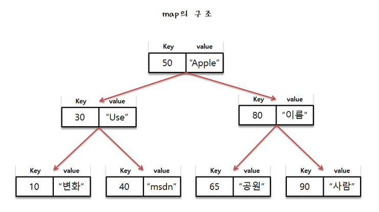

# 문제: [백준 : 1620번 나는야 포켓몬 마스터 이다솜 ][link]

[link]: https://www.acmicpc.net/problem/1620

### 출제자 : 윤도운

---

## 풀이법

### MAP 이란 ??

- 자료를 저장하고 탐색키를 이용해 원하는 자료를 빠르게 찾을 수 있도록 하는 탐색을 위한 자료구조
- 각 노드가 {key : value} 쌍으로 이루어진 균형 이진 트리 구조
- Key가 중복이 되는 것을 허용 X
- 삽입, 삭제시 자동으로 오름차순 정렬
- key -> first 인자 / value -> second 인자

문제에서 원하는 값을 탐색하기 위해서 두 가지 방법이 있다.

1. 포켓몬 이름으로 번호를 검색 / string -> int
2. 번호로 포켓몬 이름 검색 / int -> string

string -> int 일 때는

- map 시간 복잡도 : O(logN)
- array 시간 복잡도 : O(n)

int -> string 일 때는

- map 시간 복잡도 : O(logN)
- array 시간 복잡도 : O(1)

1번의 경우는 MAP으로, 2번의 경우는 배열의 인덱스를 이용해서 풀어야 한다.

▼ 포켓몬 이름을 key / 번호를 value로 짝을 지어서 MAP에 데이터를 삽입한다. ( 배열에도 이름 PUSH )

        for (int i = 1; i <= N; i++) {
        cin >> input;
        name.push_back(input); // 번호로 찾기 위한 배열
        poketmonMap.insert(make_pair(input, i)); //  <포켓몬 이름 ,번호>
    }

▼ 이름이 주어진 경우 MAP, 숫자가 주어진 경우 배열의 인덱스를 이용하여 원하느 값을 탐색한다.

       for (int i = 0; i < M; i++) {
        cin >> input;
        // 1. 이름이 주어진 경우
        if (input[0] >= 65 && input[0] <= 90) {
            result.push_back(to_string(poketmonMap[input]));
        }
        // 2. 번호가 주어진 경우
        else
        {
            result.push_back(name[stoi(input) - 1]);  // 배열 인덱스는 0부터 시작
        }
    }

---
