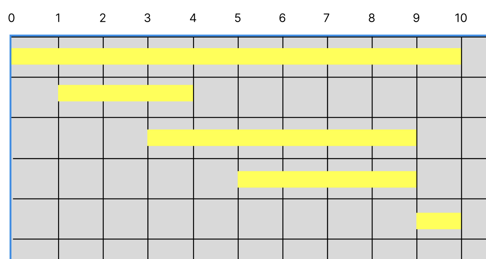
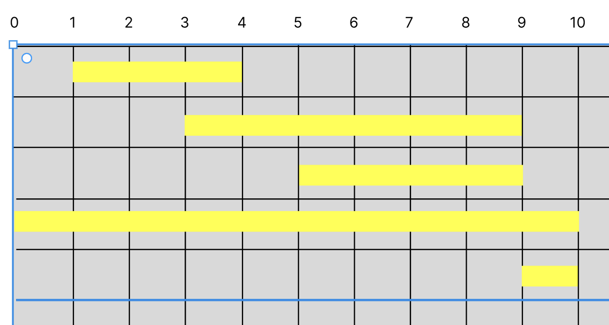
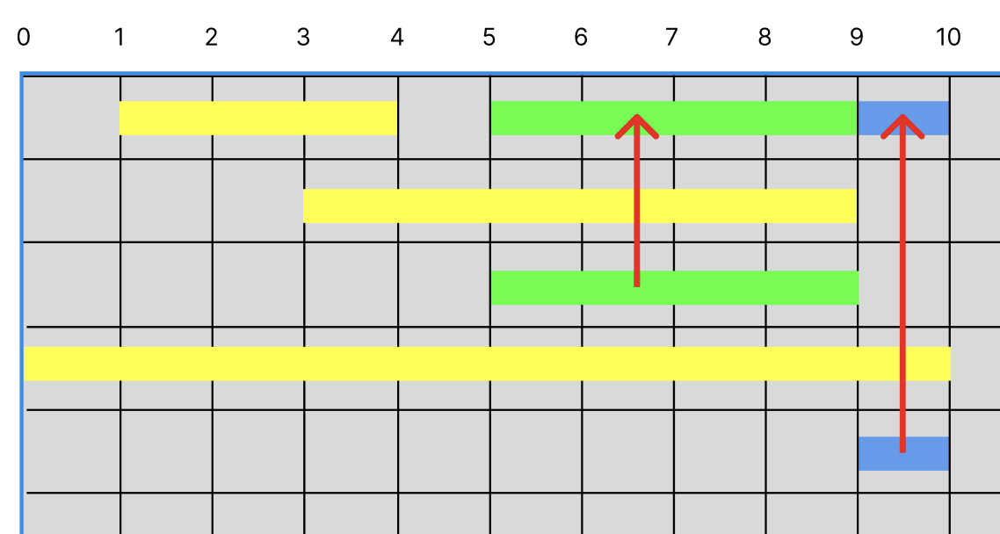
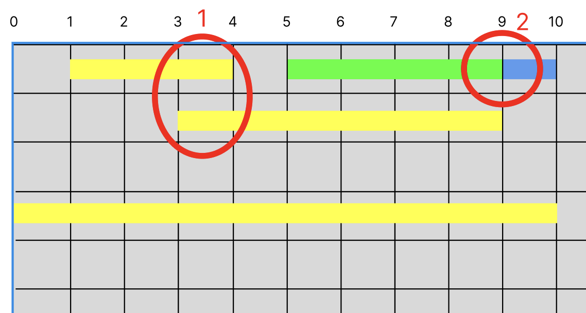
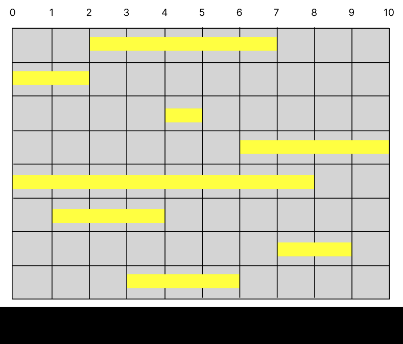

# 문제: [회의실 배정][link]

[link]: https://www.acmicpc.net/problem/1931

### 출제자 : 최은우

---
### 풀이법 : 

## 1. 정렬을 먼저

하나의 회의실에서 얼마나 많은 회의를 할 수 있는지를 구하는것이 목표  
정렬을 할것이라고 기준을 둔다면 두가지 방법으로 정렬이 가능한데  
아래 5가지 회의를 두고 정렬을 해보자
```
0 ~ 10
1 ~ 4
5 ~ 8
3 ~ 9
9 ~ 10
```

1. 일찍 시작하는 회의를 기준




2. 일찍 끝나는 회의를 기준



3. 해당 회의에서의 회의 배치



한 회의실에서 최대한 많은 회의를 해야하는게 정답인 상황에서는 아무리 일찍 시작하는 회의라도 매우 늦게 끝나면 해당 회의는 정답에 들어갈 회의로 카운되긴 힘들어보인다.  
회의가 빠르게 끝날수록 많은 회의를 연달아 진행 할 수 있다는 걸 알수 있다.  
이렇게 그림으로 먼저 추상화를 해두면 다음부터는 문제풀이가 간단해진다.

## 2. 다음 조건 생각하기

끝나는 시간이 빠른것을 기준으로 소팅을 한다는 것을 이해했다면 다음 조건은 무엇인지 생각해본다.  
한 회의실에선 하나의 회의밖에 진행을 못하기 때문에 끝나자 마자 회의가 진행되는건 가능하나(1) 끝나기 전에 다른 회의를 시작시킬 수는 없다(2)



그렇기에 제일 빠르게 끝나는 회의를 pivot으로 기준잡고 그보다 일찍 시작하면 패스하고  
끝나는 시간보다 늦게 시작하는 회의가 있다면 해당 회의의 끝나는 시간을 다시 pivot으로 지정하고 다음 회의들을 돌려보면 된다.

## 3. 정답

해당 문제의 예제 입력은 이미 정렬이 되어 있는 값이므로 새로운 예제로 보자
```
8
2 7
0 2
4 5
6 10
0 8
1 4
7 9
3 6
```



처음 만들라니 지저분한데 이런식으로 동작하게끔 코드 짜면 된다 ㅎㅇㅌ