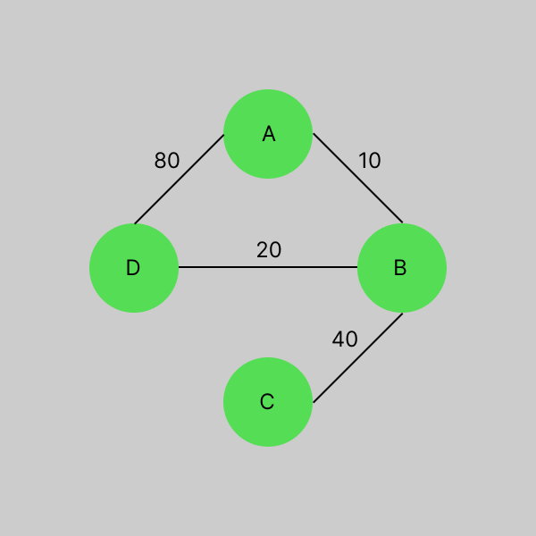
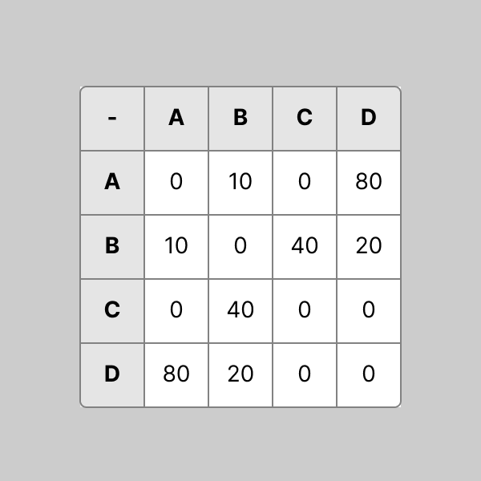
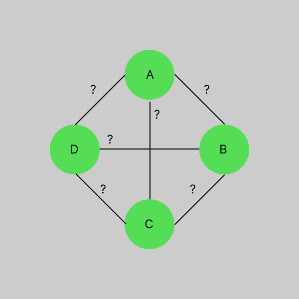
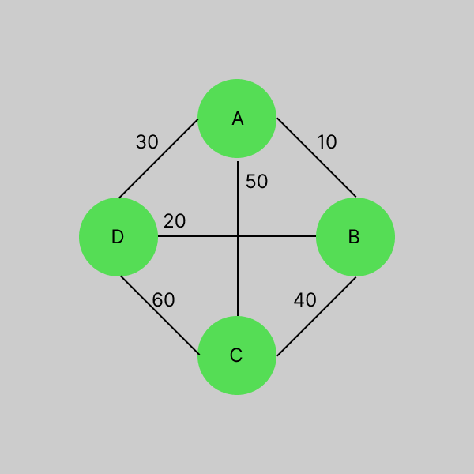

# 문제: [경로 찾기][link]

[link]: https://www.acmicpc.net/problem/11403

### 출제자 : 최은우

---

### 풀이법 :

플로이드 워셜에 대해서 이해를 해보자

플로이드 워셜 알고리즘은 음수 사이클이 없는 가중 그래프(양의 가중치 또는 음의 가중치 둘다 가능)에서 최단 경로를 찾는 알고리즘을 말하는데 최단거리를 구하는 알고리즘으로 양의 가중치를 기준으로 놓고 설명을 하겠다.

하나의 예시를 두고 보자 다음은 4개의 노드와 각 가중치를 가지는 무방향 그래프이다.(1)(2)



플로이드 워셜 알고리즘의 목표는 각 노드에서 다음 노드까지의 최단경로를 찾는 문제이기에 다음과 같은 그래프의 물음표에 값을 구한다고 생각하면 된다.(3)



그리고 우리는 알고리즘으로 풀지 않고 간단히 눈과 손으로 해당 물음표에 답을 유추할 수 있고 값은 다음과 같을 것이다.(4)


역으로 생각해보자 왜 A에서 D로 가는 거리가 80이라고 제공되었지만 30이라는 길이 최단거리가 되는 이유가 무엇인가?

A에서 D로 곧바로 가는 것(80) 보다 A에서 B로 B 에서 D로 이동하는 것이(10 + 20) 최단거리였기 때문이다. A라는 출발지에서 D라는 목적지에 도착하기까지 B라는 경유지를 거친것이라 본다

다른 값도 보자  
C에서 D로 가는 길도 생각해보자 C에서 D로 가는길은 C-B-D(40+20) 와 C-B-A-D(40+10+80) 두 방법이 있을테고 이 중 최단거리는 C-B-D였기에 60이라는 값이 나오는것이다.

이처럼

**<font color= "GREEN"> 출발지 i 에서 목적지 j 에 도착하기까지 경유지 K 를 거쳐서 가능 경우의 수</font>**

를 체크를 하고 그 중 최단거리를 구하는것이 플로이드 워셜 알고리즘이라 말하고  
위 문장을 식으로 만들면 다음과 같은 식이 된다

```
graph[i][j] = min(graph[i][j] , graph[i][k] + graph[k][j])
```

그리고 **모든 출발지에서 모든 도착지까지 가는 경우의 수** 중 **모든 경유지를 거쳐야 하는 경우의 수** 를 구하여야 하기 때문에 다음과 같은 3중 for문이 구성이 된다

```
// 1. 초기화
dist = n*n 사이즈의 각 경로값이 있는 그래프
graph = n*n 사이즈의 infinity 로 초기화 된 배열

// 2. 스스로에게 가는길은 항상 0이다
for i from 1 to n:
  graph[i][i] = 0

// 3. 처음 경로값들을 그래프에 배정해준다
for i from 1 to n:
  for j from 1 to n:
    graph[i][j] = dist[i][j]
    
// 4. 플로이드 워셜 알고리즘
for k from 1 to n: 
  for i from 1 to n:
    for j from 1 to n:
      graph[i][j] = min( graph[i][j] , graph[i][k] + graph[k][j] )
```

코드로 위 예시를 돌려보자
