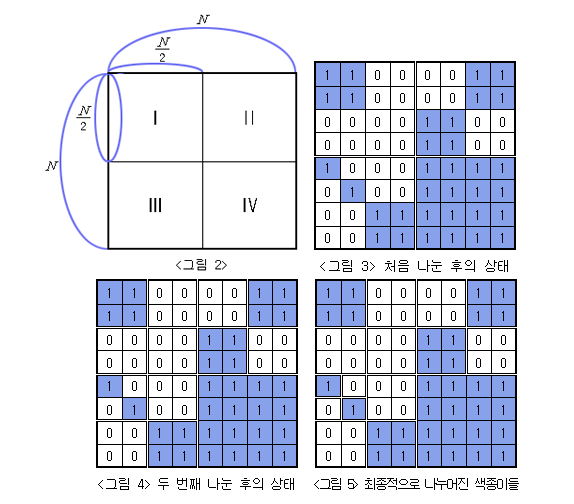

# 문제: [백준 - 2630번 색종이 만들기 ][link]

[link]: https://www.acmicpc.net/problem/2630

### 출제자 : 윤도운

---

### 풀이법

전체 종이의 크기가 N x N (N= 2^7, k는 1 이상 7 이하의 자연수)이며
종이를 자르는 규칙은 가로 세로 중간 부분을 잘라서 똑같은 키기의 네 개의 N/2 x N/2 색종이로 나눈다.

색종이는 하나의 색으로만 이루어져 있으므로, 하얀색 또는 파랑색으로만 이루어져 있다면 더 이상 탐색은 필요하지 않다.

하지만 탐색을 진행하면서 다른 색이 나오면 탐색을 중지하고,
"현재 사각형의 변의 길이 / 2"로 잘라서 탐색을 다시 진행한다.

색종이가 좌표 위의 원점에 있다고 가정하고, 한 변의 길이는 N, 시작 좌표는 x, y로 설정한다.
[ X 좌표 , Y 좌표, 현재 사각형의 한 변의 길이 ]

색종이를 자를때 마다 4개의 사각형이 나오기 때문에 좌표를 수식으로 나타내면 다음과 같다

- (x , y , N/2)
- (x + N/2 , y , N/2)
- (x , y + N/2, N/2)
- (x + N/2, y + N/2 , N/2)

재귀 호출하여 색종이를 더 이상 자를 수 없을 때까지 반복하여 색종이의 개수를 각각 카운트 한다.
